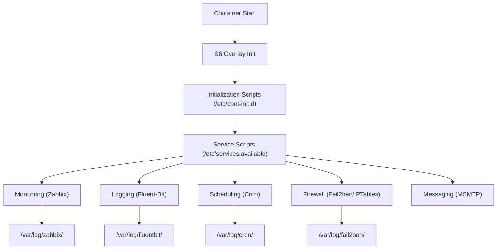

# Docker Debian Base Image

[](https://github.com/focela/docker-debian/releases/latest)
[](https://github.com/focela/docker-debian/actions)
[](https://hub.docker.com/r/focela/debian/)
[](https://hub.docker.com/r/focela/debian/)
[](https://github.com/sponsors/focela)
[](https://www.paypal.me/focela)

---

## About

This is a production-ready [Debian Linux](https://www.debian.org/) base container image designed to serve as a foundation for containerized applications requiring comprehensive monitoring, logging, and security capabilities.

### Supported Debian Versions

Currently tracking Debian versions: **buster** and **bullseye**.

## Features

- **🔧 Process Supervision**: [S6 overlay](https://github.com/just-containers/s6-overlay) enabled for robust PID 1 init capabilities
- **📊 Monitoring**: [Zabbix Agent](https://zabbix.org) (both Classic and Modern) for comprehensive container monitoring
- **📅 Task Scheduling**: Built-in cron scheduling with helpful management tools (bash, curl, less, logrotate, nano)
- **📧 Messaging**: MSMTP integration for sending mail from containers to external SMTP servers
- **🔒 Security**: Fail2ban firewall with log monitoring capabilities to block malicious hosts
- **📦 Log Shipping**: [Fluent-Bit](https://github.com/fluent/fluent-bit) integration for remote log analysis
- **👥 Flexible Permissions**: Dynamic User ID and Group ID permission management
- **🏗️ Multi-Architecture**: Support for AMD64, ARM64, and ARM/v7 architectures

## Maintainer

- [Dave Conroy](https://github.com/focela)

## Table of Contents

- [About](#about)
- [Features](#features)
- [Maintainer](#maintainer)
- [Prerequisites](#prerequisites)
- [Installation](#installation)
    - [Build from Source](#build-from-source)
    - [Prebuilt Images](#prebuilt-images)
        - [Multi-Architecture Support](#multi-architecture-support)
- [Quick Start](#quick-start)
- [Configuration](#configuration)
    - [Persistent Storage](#persistent-storage)
    - [Environment Variables](#environment-variables)
        - [Container Options](#container-options)
        - [Scheduling Options](#scheduling-options)
        - [Messaging Options](#messaging-options)
        - [Monitoring Options](#monitoring-options)
        - [Logging Options](#logging-options)
        - [Firewall Options](#firewall-options)
        - [Permission Management](#permission-management)
        - [Process Watchdog](#process-watchdog)
- [Networking](#networking)
- [Advanced Usage](#advanced-usage)
    - [Development](#development)
    - [Debug Mode](#debug-mode)
- [Maintenance](#maintenance)
- [Support](#support)
- [Contributing](#contributing)
- [Security](#security)
- [Changelog](#changelog)
- [FAQ](#faq)
- [License](#license)

## Prerequisites

No prerequisites required - this image is designed to run out of the box.

## Installation

### Build from Source

Clone this repository and build the image:

```bash
git clone https://github.com/focela/docker-debian.git
cd docker-debian
docker build -t focela/debian .
```

### Prebuilt Images

#### Docker Hub

```bash
docker pull docker.io/focela/debian:(imagetag)
```

#### GitHub Container Registry

```bash
docker pull ghcr.io/focela/docker-debian:(imagetag)
```

#### Available Tags

| Debian Version | Tag         |
|---------------|-------------|
| `bullseye`    | `:bullseye` |
| `buster`      | `:buster`   |

### Multi-Architecture Support

Images are built primarily for `amd64` architecture, with additional builds for `arm/v7` and `arm64`. To check supported architectures:

```bash
docker manifest inspect focela/debian:(tag)
```

> **Note**: ARM variants are unsupported. Consider [sponsoring](https://github.com/sponsors/focela) our development for enhanced ARM support.

## Quick Start

Use this image as a base for your applications. Please visit the [S6 overlay repository](https://github.com/just-containers/s6-overlay) for instructions on how to enable the S6 init system when using this base, or examine other images that use this as a foundation.

```dockerfile
FROM focela/debian:latest

# Your application setup here
COPY . /app
WORKDIR /app

# The S6 overlay will handle process supervision
```

### Sample Docker Compose

```yaml
version: '3'
services:
  app:
    image: focela/debian:latest
    environment:
      - CONTAINER_ENABLE_LOG_TIMESTAMP=TRUE
      - DEBUG_MODE=TRUE
    volumes:
      - ./app:/app
      - ./logs:/var/log
    ports:
      - "2020:2020"
      - "10050:10050"
```

## Configuration

### Persistent Storage

Map these directories for persistent storage:

| Directory                           | Description                               |
|-------------------------------------|-------------------------------------------|
| `/etc/fluent-bit/conf.d/`           | Fluent-Bit custom configuration files    |
| `/etc/fluent-bit/parsers.d/`        | Fluent-Bit custom parsers                |
| `/etc/zabbix/zabbix_agentd.conf.d/` | Zabbix Agent configuration files         |
| `/etc/fail2ban/filter.d`            | Custom Fail2ban filter configurations    |
| `/etc/fail2ban/jail.d`              | Custom Fail2ban jail configurations      |
| `/var/log`                          | Container, cron, Zabbix, and other logs  |
| `/assets/cron`                      | Custom crontab files                     |
| `/assets/iptables`                  | Custom IPTables rules                    |

### Environment Variables

Variables marked with `_FILE` can store values in files for secret management.

#### Container Options

| Parameter                             | Description                                                                   | Default                            |
|---------------------------------------|-------------------------------------------------------------------------------|------------------------------------|
| `CONTAINER_ENABLE_LOG_TIMESTAMP`      | Prefix container logs with timestamps                                        | `TRUE`                             |
| `CONTAINER_COLORIZE_OUTPUT`           | Enable colorized console output                                              | `TRUE`                             |
| `CONTAINER_CUSTOM_BASH_PROMPT`        | Custom bash prompt (default: `(imagename):(version) HH:MM:SS #`)            |                                    |
| `CONTAINER_CUSTOM_PATH`               | Path for custom files during startup                                         | `/assets/custom`                   |
| `CONTAINER_CUSTOM_SCRIPTS_PATH`       | Path for custom startup scripts                                              | `/assets/custom-scripts`           |
| `CONTAINER_ENABLE_PROCESS_COUNTER`    | Show process execution count in console logs                                 | `TRUE`                             |
| `CONTAINER_LOG_LEVEL`                 | Console log level: `INFO`, `WARN`, `NOTICE`, `DEBUG`                         | `NOTICE`                           |
| `CONTAINER_LOG_PREFIX_TIME_FMT`       | Timestamp time format                                                        | `%H:%M:%S`                         |
| `CONTAINER_LOG_PREFIX_DATE_FMT`       | Timestamp date format                                                        | `%Y-%m-%d`                         |
| `CONTAINER_LOG_PREFIX_SEPARATOR`      | Timestamp separator                                                          | `-`                                |
| `CONTAINER_LOG_FILE_LEVEL`            | File log level: `INFO`, `WARN`, `NOTICE`, `DEBUG`                            | `DEBUG`                            |
| `CONTAINER_LOG_FILE_NAME`             | Internal container log filename                                               | `/var/log/container/container.log` |
| `CONTAINER_LOG_FILE_PATH`             | Path for internal container logs                                              | `/var/log/container/`              |
| `CONTAINER_LOG_FILE_PREFIX_TIME_FMT`  | File timestamp time format                                                   | `%H:%M:%S`                         |
| `CONTAINER_LOG_FILE_PREFIX_DATE_FMT`  | File timestamp date format                                                   | `%Y-%m-%d`                         |
| `CONTAINER_LOG_FILE_PREFIX_SEPARATOR` | File timestamp separator                                                     | `-`                                |
| `CONTAINER_NAME`                      | Container name for monitoring and log shipping                                | (hostname)                         |
| `CONTAINER_POST_INIT_COMMAND`         | Commands to execute after service initialization (comma-separated)           |                                    |
| `CONTAINER_POST_INIT_SCRIPT`          | Scripts to execute after service initialization (comma-separated)            |                                    |
| `TIMEZONE`                            | Container timezone                                                            | `Etc/GMT`                          |

#### Scheduling Options

The image supports executing tasks at different times using cron syntax. Currently supports busybox cron but can be extended to other scheduling backends.

| Parameter                       | Description                                     | Default          |
|---------------------------------|-------------------------------------------------|------------------|
| `CONTAINER_ENABLE_SCHEDULING`   | Enable scheduled tasks                          | `TRUE`           |
| `CONTAINER_SCHEDULING_BACKEND`  | Scheduling backend (`cron`)                     | `cron`           |
| `CONTAINER_SCHEDULING_LOCATION` | Task files location                             | `/assets/cron/`  |
| `SCHEDULING_LOG_TYPE`           | Log type (`FILE`)                               | `FILE`           |
| `SCHEDULING_LOG_LOCATION`       | Log file location                               | `/var/log/cron/` |
| `SCHEDULING_LOG_LEVEL`          | Log level (1=loud to 8=quiet)                  | `6`              |

##### Cron Configuration

Add cron jobs by dropping files into `/assets/cron/` or using environment variables:

| Parameter | Description                                            | Default |
|-----------|--------------------------------------------------------|---------|
| `CRON_*`  | Name of the job value of the time and output to be run |         |

**Example**: `CRON_HELLO="* * * * * echo 'hello' > /tmp/hello.log"`

To disable inherited cron jobs, set the value to `FALSE`: `CRON_HELLO=FALSE`

#### Messaging Options

Enable messaging services for SMTP mail delivery from containers.

| Parameter                     | Description                        | Default |
|-------------------------------|------------------------------------|---------|
| `CONTAINER_ENABLE_MESSAGING`  | Enable messaging services (SMTP)   | `TRUE`  |
| `CONTAINER_MESSAGING_BACKEND` | Messaging backend (`msmtp`)         | `msmtp` |

##### MSMTP Configuration

See [MSMTP Configuration Options](https://marlam.de/msmtp/msmtp.html) for detailed information.

| Parameter                  | Description                                       | Default         | `_FILE` |
|----------------------------|---------------------------------------------------|-----------------|---------|
| `SMTP_AUTO_FROM`           | Support Gmail SMTP sending                       | `FALSE`         |         |
| `SMTP_HOST`                | SMTP server hostname                              | `postfix-relay` | ✓       |
| `SMTP_PORT`                | SMTP server port                                  | `25`            | ✓       |
| `SMTP_DOMAIN`              | HELO domain                                       | `docker`        |         |
| `SMTP_MAILDOMAIN`          | Mail domain                                       | `local`         |         |
| `SMTP_AUTHENTICATION`      | SMTP authentication method                        | `none`          |         |
| `SMTP_USER`                | SMTP username                                     |                 | ✓       |
| `SMTP_PASS`                | SMTP password                                     |                 | ✓       |
| `SMTP_TLS`                 | Enable TLS                                        | `FALSE`         |         |
| `SMTP_STARTTLS`            | Enable STARTTLS                                   | `FALSE`         |         |
| `SMTP_TLSCERTCHECK`        | Verify remote certificates                        | `FALSE`         |         |
| `SMTP_ALLOW_FROM_OVERRIDE` | Allow From override                               |                 |         |

#### Monitoring Options

This image includes monitoring agents for application metrics. Currently supports Zabbix with extensibility for other platforms.

| Parameter                     | Description                          | Default  |
|-------------------------------|--------------------------------------|----------|
| `CONTAINER_ENABLE_MONITORING` | Enable application monitoring        | `TRUE`   |
| `CONTAINER_MONITORING_BACKEND`| Monitoring backend (`zabbix`)         | `zabbix` |

##### Zabbix Configuration

This image supports both Zabbix Agent 1 (Classic/C compiled) and Zabbix Agent 2 (Modern/Go compiled). See the [Official Zabbix Agent Documentation](https://www.zabbix.com/documentation/5.4/manual/appendix/config/zabbix_agentd) for detailed information.

Drop configuration files in `/etc/zabbix/zabbix_agentd.conf.d/` to set up metrics. Change `ZABBIX_SETUP_TYPE` to `MANUAL` to use custom configuration without these variables.

| Parameter                            | Description                                                        | Default                  | Agent 1 | Agent 2 | `_FILE` |
|--------------------------------------|--------------------------------------------------------------------|--------------------------|---------|---------|---------|
| `ZABBIX_SETUP_TYPE`                  | Configuration type: `AUTO` or `MANUAL`                            | `AUTO`                   | ✓       | ✓       |         |
| `ZABBIX_AGENT_TYPE`                  | Agent version: `1` or `2`                                          | `1`                      | N/A     | N/A     |         |
| `ZABBIX_AGENT_LOG_PATH`              | Log file path                                                      | `/var/log/zabbix/agent/` | ✓       | ✓       |         |
| `ZABBIX_AGENT_LOG_FILE`              | Log filename                                                       | `zabbix_agentd.log`      | ✓       | ✓       |         |
| `ZABBIX_CERT_PATH`                   | Zabbix certificates path                                           | `/etc/zabbix/certs/`     | ✓       | ✓       |         |
| `ZABBIX_ENABLE_AUTOREGISTRATION`     | Enable automatic agent registration based on config files         | `TRUE`                   | ✓       | ✓       |         |
| `ZABBIX_ENABLE_AUTOREGISTRATION_DNS` | Register with DNS name instead of IP address                      | `TRUE`                   | ✓       | ✓       |         |
| `ZABBIX_AUTOREGISTRATION_DNS_NAME`   | DNS name for auto registration (uses `CONTAINER_NAME` as default) | `$CONTAINER_NAME`        | ✓       | ✓       |         |
| `ZABBIX_AUTOREGISTRATION_DNS_SUFFIX` | Suffix to append to generated DNS name                            |                          | ✓       | ✓       |         |
| `ZABBIX_ENCRYPT_PSK_ID`              | Zabbix encryption PSK ID                                          |                          | ✓       | ✓       | ✓       |
| `ZABBIX_ENCRYPT_PSK_KEY`             | Zabbix encryption PSK key                                         |                          | ✓       | ✓       | ✓       |
| `ZABBIX_ENCRYPT_PSK_FILE`            | Zabbix encryption PSK file (alternative to env var)               |                          | ✓       | ✓       |         |
| `ZABBIX_LOG_FILE_SIZE`               | Logfile size                                                       | `0`                      | ✓       | ✓       |         |
| `ZABBIX_DEBUGLEVEL`                  | Debug level                                                        | `1`                      | ✓       | ✓       |         |
| `ZABBIX_REMOTECOMMANDS_ALLOW`        | Enable remote commands                                             | `*`                      | ✓       | ✓       |         |
| `ZABBIX_REMOTECOMMANDS_DENY`         | Deny remote commands                                               |                          | ✓       | ✓       |         |
| `ZABBIX_REMOTECOMMANDS_LOG`          | Enable remote commands log (`0`/`1`)                              | `1`                      | ✓       |         |         |
| `ZABBIX_SERVER`                      | Allow connections from Zabbix server IP                           | `0.0.0.0/0`              | ✓       | ✓       |         |
| `ZABBIX_STATUS_PORT`                 | Agent status port (http://localhost:port/status)                  | `10050`                  |         | ✓       |         |
| `ZABBIX_LISTEN_PORT`                 | Zabbix Agent listening port                                       | `10050`                  | ✓       | ✓       |         |
| `ZABBIX_LISTEN_IP`                   | Zabbix Agent listening IP                                         | `0.0.0.0`                | ✓       | ✓       |         |
| `ZABBIX_START_AGENTS`                | Number of Zabbix Agents to start                                  | `1`                      | ✓       |         |         |
| `ZABBIX_SERVER_ACTIVE`               | Server for active checks                                          | `zabbix-proxy`           | ✓       | ✓       | ✓       |
| `ZABBIX_HOSTNAME`                    | Container hostname to report to server                            | `$CONTAINER_NAME`        | ✓       | ✓       |         |
| `ZABBIX_REFRESH_ACTIVE_CHECKS`       | Seconds to refresh active checks                                  | `120`                    | ✓       | ✓       |         |
| `ZABBIX_BUFFER_SEND`                 | Buffer send                                                       | `5`                      | ✓       | ✓       |         |
| `ZABBIX_BUFFER_SIZE`                 | Buffer size                                                       | `100`                    | ✓       | ✓       |         |
| `ZABBIX_MAXLINES_SECOND`             | Max lines per second                                              | `20`                     | ✓       |         |         |
| `ZABBIX_SOCKET`                      | Socket for communicating                                          | `/tmp/zabbix.sock`       |         | ✓       |         |
| `ZABBIX_ALLOW_ROOT`                  | Allow running as root                                             | `1`                      | ✓       |         |         |
| `ZABBIX_USER`                        | User to start agent                                               | `zabbix`                 | ✓       | ✓       |         |
| `ZABBIX_USER_SUDO`                   | Allow Zabbix user to utilize sudo commands                       | `TRUE`                   | ✓       | ✓       |         |

> **Auto-registration**: The image supports autoregistering configuration as an Active Agent. It looks for `# Autoregister=` in `/etc/zabbix/zabbix_agentd.conf.d/*.conf` files and adds these values to the `HostMetadata` configuration entry wrapped in colons (`:application:`). Server templates are available in the `zabbix_templates/` directory.

#### Logging Options

Comprehensive logging solution with rotation and shipping capabilities. Currently supports Fluent-Bit for log shipping on x86_64 architecture.

| Parameter                                | Description                                                 | Default      |
|------------------------------------------|-------------------------------------------------------------|--------------|
| `CONTAINER_ENABLE_LOGROTATE`             | Enable log rotation (requires scheduling)                  | `TRUE`       |
| `CONTAINER_ENABLE_LOGSHIPPING`           | Enable log shipping                                         | `FALSE`      |
| `CONTAINER_LOGSHIPPING_BACKEND`          | Log shipping backend (`fluent-bit`)                        | `fluent-bit` |
| `LOGROTATE_COMPRESSION_TYPE`             | Compression: `NONE`, `BZIP2`, `GZIP`, `ZSTD`               | `ZSTD`       |
| `LOGROTATE_COMPRESSION_VALUE`            | Compression level                                           | `8`          |
| `LOGROTATE_COMPRESSION_EXTRA_PARAMETERS` | Extra compression parameters (optional)                     |              |
| `LOGROTATE_RETAIN_DAYS`                  | Log retention period (days)                                 | `7`          |

##### Log Shipping Parsing

Set environment variables to start shipping logs without additional configuration. Create variables starting with `LOGSHIP_<name>` with the log file location value. Use `FALSE` to disable existing configurations.

**Example**: `LOGSHIP_NGINX=/var/log/nginx/*.log` creates and tags all log files from that directory as coming from `CONTAINER_NAME` and from `nginx`.

| Parameter                           | Description                                                          | Default |
|-------------------------------------|----------------------------------------------------------------------|---------|
| `LOGSHIPPING_AUTO_CONFIG_LOGROTATE` | Auto-configure log shipping for files in `/etc/logrotate.d`         | `TRUE`  |

For custom parsing, add `# logship: <parser>` lines in `logrotate.d/<file>`. Multiple parsers can be comma-separated. Use "SKIP" to exclude files from log shipping.

##### Fluent-Bit Configuration

Drop configuration files in `/etc/fluent-bit/conf.d/` for inputs and outputs. Change `FLUENTBIT_SETUP_TYPE` to `MANUAL` for custom configuration without these variables. The container can automatically create configurations for sending to destinations or act as a receiver for forwarding to remote log analysis services.

| Parameter                             | Description                                      | Default                  | `_FILE` |
|---------------------------------------|--------------------------------------------------|--------------------------|---------|
| `FLUENTBIT_CONFIG_PARSERS`            | Parsers config file name                         | `parsers.conf`           |         |
| `FLUENTBIT_CONFIG_PLUGINS`            | Plugins config file name                         | `plugins.conf`           |         |
| `FLUENTBIT_ENABLE_HTTP_SERVER`        | Embedded HTTP server for metrics                 | `TRUE`                   |         |
| `FLUENTBIT_ENABLE_STORAGE_METRICS`    | Public storage pipeline metrics in /api/v1/storage | `TRUE`                   |         |
| `FLUENTBIT_FLUSH_SECONDS`             | Wait time to flush records (seconds)             | `1`                      |         |
| `FLUENTBIT_FORWARD_BUFFER_CHUNK_SIZE` | Buffer chunk size                                | `32KB`                   |         |
| `FLUENTBIT_FORWARD_BUFFER_MAX_SIZE`   | Buffer maximum size                              | `64KB`                   |         |
| `FLUENTBIT_FORWARD_PORT`              | Port for `PROXY` (listen) or `FORWARD` (client) | `24224`                  |         |
| `FLUENTBIT_GRACE_SECONDS`             | Wait time before exit (seconds)                  | `1`                      |         |
| `FLUENTBIT_HTTP_LISTEN_IP`            | HTTP listen IP                                   | `0.0.0.0`                |         |
| `FLUENTBIT_HTTP_LISTEN_PORT`          | HTTP listening port                              | `2020`                   |         |
| `FLUENTBIT_LOG_FILE`                  | Log file                                         | `fluentbit.log`          |         |
| `FLUENTBIT_LOG_LEVEL`                 | Log level: `info`, `warn`, `error`, `debug`, `trace` | `info`                   |         |
| `FLUENTBIT_LOG_PATH`                  | Log path                                         | `/var/log/fluentbit/`    |         |
| `FLUENTBIT_MODE`                      | Operation mode: `NORMAL` (client) or `PROXY`     | `NORMAL`                 |         |
| `FLUENTBIT_OUTPUT_FORWARD_HOST`       | Forward destination host                         | `fluent-proxy`           | ✓       |
| `FLUENTBIT_OUTPUT_FORWARD_TLS_VERIFY` | Verify certificates when using TLS               | `FALSE`                  |         |
| `FLUENTBIT_OUTPUT_FORWARD_TLS`        | Enable TLS when forwarding                       | `FALSE`                  |         |
| `FLUENTBIT_OUTPUT_LOKI_COMPRESS_GZIP` | Enable GZIP compression for Loki                 | `TRUE`                   |         |
| `FLUENTBIT_OUTPUT_LOKI_HOST`          | Loki output host                                 | `loki`                   | ✓       |
| `FLUENTBIT_OUTPUT_LOKI_PORT`          | Loki output port                                 | `3100`                   | ✓       |
| `FLUENTBIT_OUTPUT_LOKI_TLS`           | Enable TLS for Loki output                       | `FALSE`                  |         |
| `FLUENTBIT_OUTPUT_LOKI_TLS_VERIFY`    | Enable TLS certificate verification for Loki    | `FALSE`                  |         |
| `FLUENTBIT_OUTPUT_LOKI_USER`          | Username for Loki authentication (optional)      |                          | ✓       |
| `FLUENTBIT_OUTPUT_LOKI_PASS`          | Password for Loki authentication (optional)      |                          | ✓       |
| `FLUENTBIT_OUTPUT_TENANT_ID`          | Tenant ID for Loki server (optional)             |                          | ✓       |
| `FLUENTBIT_OUTPUT`                    | Output plugin: `LOKI`, `FORWARD`, `NULL`         | `FORWARD`                |         |
| `FLUENTBIT_TAIL_BUFFER_CHUNK_SIZE`    | Buffer chunk size for tail                       | `32k`                    |         |
| `FLUENTBIT_TAIL_BUFFER_MAX_SIZE`      | Maximum size for tail                            | `32k`                    |         |
| `FLUENTBIT_TAIL_READ_FROM_HEAD`       | Read from head instead of tail                   | `FALSE`                  |         |
| `FLUENTBIT_TAIL_SKIP_EMPTY_LINES`     | Skip empty lines when tailing                    | `TRUE`                   |         |
| `FLUENTBIT_TAIL_SKIP_LONG_LINES`      | Skip long lines when tailing                     | `TRUE`                   |         |
| `FLUENTBIT_TAIL_DB_ENABLE`            | Enable offset DB per tracked file               | `TRUE`                   |         |
| `FLUENTBIT_TAIL_DB_SYNC`              | DB sync type: `normal` or `full`                 | `normal`                 |         |
| `FLUENTBIT_TAIL_DB_LOCK`              | Lock access to DB file                           | `TRUE`                   |         |
| `FLUENTBIT_TAIL_DB_JOURNAL_MODE`      | Journal mode: `WAL`, `DELETE`, `TRUNCATE`, `PERSIST`, `MEMORY`, `OFF` | `WAL`                    |         |
| `FLUENTBIT_TAIL_KEY_PATH_ENABLE`      | Enable sending key for log filename/path         | `TRUE`                   |         |
| `FLUENTBIT_TAIL_KEY_PATH`             | Path key name                                    | `filename`               |         |
| `FLUENTBIT_TAIL_KEY_OFFSET_ENABLE`    | Enable sending key for offset in log file        | `FALSE`                  |         |
| `FLUENTBIT_TAIL_KEY_OFFSET`           | Offset path key name                             | `offset`                 |         |
| `FLUENTBIT_SETUP_TYPE`                | Configuration type: `AUTO` or `MANUAL`           | `AUTO`                   |         |
| `FLUENTBIT_STORAGE_BACKLOG_LIMIT`     | Maximum memory for backlogged/unsent records    | `5M`                     |         |
| `FLUENTBIT_STORAGE_CHECKSUM`          | Create CRC32 checksum for filesystem RW         | `FALSE`                  |         |
| `FLUENTBIT_STORAGE_PATH`              | Filesystem data buffers storage path             | `/tmp/fluentbit/storage` |         |
| `FLUENTBIT_STORAGE_SYNC`              | Synchronization mode: `normal` or `full`         | `normal`                 |         |

#### Firewall Options

Advanced firewall functionality with detailed block/allow rules. Currently supports IPTables backend.

> **Requirements**: Containers must run with `NET_ADMIN` and `NET_RAW` capabilities.

| Parameter                    | Description                             | Default    |
|------------------------------|-----------------------------------------|------------|
| `CONTAINER_ENABLE_FIREWALL`  | Enable firewall functionality           | `FALSE`    |
| `CONTAINER_FIREWALL_BACKEND` | Firewall backend (`iptables`)           | `iptables` |

Use `FIREWALL_RULE_XX` environment variables to pass rules to the firewall:

```bash
FIREWALL_RULE_00=-I INPUT -p tcp -m tcp -s 101.69.69.101 --dport 389 -j ACCEPT
FIREWALL_RULE_01=-I INPUT -p tcp -m tcp -s 0.0.0.0/0 --dport 389 -j DROP
```

##### Host Override Options

Add manual host file entries for DNS trickery:

| Parameter                    | Description               | Default |
|------------------------------|---------------------------|---------|
| `CONTAINER_HOST_OVERRIDE_01` | Create manual hosts entry |         |

Set value as `<destination> override1 override2` (e.g., `1.2.3.4 example.org example.com`). If you omit an IP address and use a domain name, it will attempt DNS lookup (e.g., `proxy example.com example.org`).

##### IPTables Options

Use `iptables-restore` compatible rulesets for advanced firewall configuration:

| Parameter             | Description                                                 | Default             |
|-----------------------|-------------------------------------------------------------|---------------------|
| `IPTABLES_RULES_PATH` | Path for IPTables rules                                     | `/assets/iptables/` |
| `IPTABLES_RULES_FILE` | IPTables rules file to restore on container start          | `iptables.rules`    |

##### Fail2Ban Configuration

Intrusion prevention system that monitors logs for patterns and blocks remote hosts. Drop custom jail configs as `*.conf` files in `/etc/fail2ban/jail.d/` and filters in `/etc/fail2ban/filter.d/`.

| Parameter                   | Description                                                        | Default                                        |
|-----------------------------|--------------------------------------------------------------------|------------------------------------------------|
| `CONTAINER_ENABLE_FAIL2BAN` | Enable Fail2ban functionality                                      | `FALSE`                                        |
| `FAIL2BAN_BACKEND`          | Backend                                                            | `AUTO`                                         |
| `FAIL2BAN_CONFIG_PATH`      | Fail2ban configuration path                                        | `/etc/fail2ban/`                               |
| `FAIL2BAN_DB_FILE`          | Persistent database file                                           | `fail2ban.sqlite3`                             |
| `FAIL2BAN_DB_PATH`          | Persistent database path                                           | `/data/fail2ban/`                              |
| `FAIL2BAN_DB_PURGE_AGE`     | Purge entries after specified seconds                              | `86400`                                        |
| `FAIL2BAN_DB_TYPE`          | Database type: `NONE`, `MEMORY`, `FILE`                            | `MEMORY`                                       |
| `FAIL2BAN_IGNORE_IP`        | Ignore these IPs or ranges (space-separated)                       | `127.0.0.1/8 ::1 172.16.0.0/12 192.168.0.0/24` |
| `FAIL2BAN_IGNORE_SELF`      | Ignore self: `TRUE` or `FALSE`                                     | `TRUE`                                         |
| `FAIL2BAN_LOG_PATH`         | Fail2ban log path                                                  | `/var/log/fail2ban/`                           |
| `FAIL2BAN_LOG_FILE`         | Fail2ban log file                                                  | `fail2ban.log`                                 |
| `FAIL2BAN_LOG_LEVEL`        | Log level: `CRITICAL`, `ERROR`, `WARNING`, `NOTICE`, `INFO`, `DEBUG` | `INFO`                                         |
| `FAIL2BAN_LOG_TYPE`         | Log destination: `FILE` or `CONSOLE`                               | `FILE`                                         |
| `FAIL2BAN_MAX_RETRY`        | Maximum times to find pattern over `FAIL2BAN_TIME_FIND`            | `5`                                            |
| `FAIL2BAN_STARTUP_DELAY`    | Startup delay for monitored logs to exist (seconds)                | `15`                                           |
| `FAIL2BAN_TIME_BAN`         | Default ban duration                                               | `10m`                                          |
| `FAIL2BAN_TIME_FIND`        | Pattern matching window                                            | `10m`                                          |
| `FAIL2BAN_USE_DNS`          | DNS lookups: `yes`, `warn`, `no`, `raw`                            | `warn`                                         |

#### Permission Management

Dynamically modify internal user and group IDs to avoid Docker permission issues during development.

| Parameter                         | Description                                          |
|-----------------------------------|------------------------------------------------------|
| `CONTAINER_USER_<USERNAME>`       | Set custom UID for specified user                   |
| `CONTAINER_GROUP_<GROUPNAME>`     | Set custom GID for specified group                  |
| `CONTAINER_GROUP_ADD_<GROUPNAME>` | Add user to specified group                         |

**Example**: Setting `CONTAINER_USER_NGINX=1000` changes the container's `nginx` user ID from `82` to `1000`.

Enable `DEBUG_PERMISSIONS=TRUE` to display all modified users and groups in output.

#### Process Watchdog

**Experimental functionality** to call external scripts before process execution.

**Sample use cases**:
- Alert Slack channels when processes execute multiple times
- Disable processes after reaching restart limits
- Write to additional log files
- Display "Under Maintenance" pages for web servers

The system passes 5 arguments to bash scripts with the same name as the executing script, or uses the default `CONTAINER_PROCESS_HELPER_SCRIPT`. Scripts receive: `DATE,TIME,SCRIPT_NAME,TIMES_EXECUTED,HOSTNAME`

**Example**: `2021-07-01 23:01:04 04-scheduling 2 container`

| Parameter                                     | Description                                     | Default                            |
|-----------------------------------------------|-------------------------------------------------|------------------------------------|
| `CONTAINER_PROCESS_HELPER_PATH`               | Path for external helper scripts               | `/assets/container/processhelper/` |
| `CONTAINER_PROCESS_HELPER_SCRIPT`             | Default helper script name                      | `processhelper.sh`                 |
| `CONTAINER_PROCESS_HELPER_DATE_FMT`           | Date format passed to external script          | `%Y-%m-%d`                         |
| `CONTAINER_PROCESS_HELPER_TIME_FMT`           | Time format passed to external script          | `%H:%M:%S`                         |
| `CONTAINER_PROCESS_RUNAWAY_PROTECTOR`         | Disable service after (x) executions           | `TRUE`                             |
| `CONTAINER_PROCESS_RUNAWAY_DELAY`             | Delay between process restarts (seconds)        | `1`                                |
| `CONTAINER_PROCESS_RUNAWAY_LIMIT`             | Restart limit before disabling                 | `50`                               |
| `CONTAINER_PROCESS_RUNAWAY_SHOW_OUTPUT_FINAL` | Show program output on final execution         | `TRUE`                             |

## Networking

| Port    | Service      | Description                |
|---------|--------------|----------------------------|
| `2020`  | Fluent Bit   | HTTP server and metrics    |
| `10050` | Zabbix Agent | Monitoring agent interface |

## Advanced Usage

### Development

This base image enables rapid secondary image development using structured methodology. While it strays from "one process per container," it allows quick image assembly with complex scalability options when needed.

See `/assets/functions/00-container` for detailed documentation on available commands and functions.

#### File Structure

- **Defaults**: `/assets/defaults/(script-name)`
- **Functions**: `/assets/functions/(script-name)`
- **Initialization**: `/etc/cont-init.d/(script-name)`
- **Services**: `/etc/services.available/(script-name)`

#### Initialization Script Template

```bash
#!/command/with-contenv bash          # Pull in Container Environment Variables
source /assets/functions/00-container # Pull in all custom container functions
prepare_service single                # Read functions and defaults only from matching files
PROCESS_NAME="process"                # Set prefix for logging

# Your scripting here
print_info "This is an INFO log"
print_warn "This is a WARN log"
print_error "This is an ERROR log"

liftoff                               # Write to state files in /tmp/.container/
```

#### Service Script Template

```bash
#!/command/with-contenv bash          # Pull in Container Environment Variables
source /assets/functions/00-container # Pull in all custom container functions
prepare_service defaults single       # Read defaults only from matching files
PROCESS_NAME="process"                # Set prefix for logging

check_container_initialized           # Check container proper initialization
check_service_initialized init        # Check cont-init.d/scriptname execution
liftoff                               # Prove script execution capability

print_start "Starting processname"    # Show STARTING log with counter/watchdog
fakeprocess (args)                    # Your process to start
```

#### Configuration Parameters

| Parameter                     | Description                                                | Default     |
|-------------------------------|------------------------------------------------------------|-------------|
| `CONTAINER_SKIP_SANITY_CHECK` | Skip checking if all scripts in /etc/cont-init.d executed | `FALSE`     |
| `DEBUG_MODE`                  | Show all script output (set -x)                           | `FALSE`     |
| `PROCESS_NAME`                | Prefix for the running script                             | `container` |

### Debug Mode

Enable debug mode for comprehensive troubleshooting and development:

```bash
docker run -e DEBUG_MODE=TRUE focela/debian
```

**Debug mode effects**:
- Sets Zabbix agent to verbose logging
- Shows all script output (equivalent to `set -x`)
- Provides detailed initialization and process information

When using this as a base image, create statements in startup scripts to check for `DEBUG_MODE=TRUE` and enable application-specific debugging modes, verbose logging, and detailed output.

### Architecture Diagram



## Maintenance

### Shell Access

Access the container shell for debugging and maintenance:

```bash
docker exec -it (container-name) bash
```

### Log Locations

- **Container logs**: `/var/log/container/`
- **Cron logs**: `/var/log/cron/`
- **Zabbix logs**: `/var/log/zabbix/`
- **Fail2ban logs**: `/var/log/fail2ban/`
- **Fluent-Bit logs**: `/var/log/fluentbit/`

## Support

These images are built for production environments and continuously improved based on community feedback.

### Usage Questions

- Visit the [Discussions Board](../../discussions) for community support and tips
- [Sponsor Focela Labs](https://focela.com/sponsor) for personalized support

### Bug Reports

- Submit [Bug Reports](../../issues/new) for any issues
- Include container logs and environment details for faster resolution

### Feature Requests

- Submit feature requests via GitHub issues
- [Sponsor development](https://focela.com/sponsor) for priority features
- No guarantee for implementation timeline without sponsorship

## Contributing

We welcome contributions! Please see our [CONTRIBUTING.md](CONTRIBUTING.md) for guidelines on submitting issues, pull requests, and coding standards.

## Security

If you discover a security vulnerability, please see our [SECURITY.md](SECURITY.md) for responsible disclosure guidelines.

## Changelog

See [Releases](https://github.com/focela/docker-debian/releases) for a complete list of changes and updates.

## FAQ

**Q: Why use Debian as a base?**  
A: Debian is stable, widely supported, and ideal for production workloads.

**Q: How do I enable debug mode?**  
A: Set `DEBUG_MODE=TRUE` as an environment variable.

**Q: How do I extend this image?**  
A: Use the provided hooks and custom script paths as described in the [Advanced Usage](#advanced-usage) section.

**Q: Where can I find example configurations?**  
A: See the [Sample Docker Compose](#sample-docker-compose) and configuration tables above.

## License

MIT License. See [LICENSE](LICENSE) for details.
